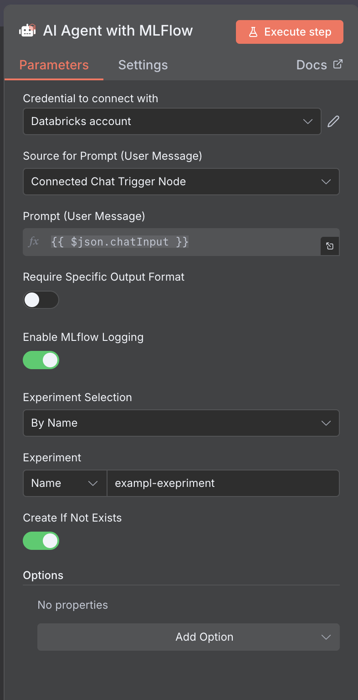

# n8n-nodes-ai-agent-mlflow


An **n8n community node** that provides an **AI Agent with optional Databricks MLflow observability**.
Built on LangChain's ToolCallingAgent, this node can optionally add comprehensive tracing of your agent's reasoning, tool usage, and LLM interactions directly to Databricks MLflow.

**Key Features:**
- **Full AI Agent** - Tool calling, memory, structured outputs, streaming
- **Optional MLflow Tracing** - Enable/disable MLflow logging with a single toggle
- **MCP Support** - Works with Model Context Protocol (MCP) toolkits
- **Databricks-First** - Built specifically for Databricks MLflow 3.0+ (when enabled)

---

## Table of Contents

- [Features](#features)
- [Installation](#installation)
  - [Docker (Recommended)](#docker-recommended)
  - [Manual Installation](#manual-installation)
- [Configuration](#configuration)
- [Usage](#usage)
- [MLflow Observability](#mlflow-observability)
- [How It Works](#how-it-works)
- [Troubleshooting](#troubleshooting)
- [Development](#development)
- [Resources](#resources)
- [License](#license)

---

## Features

### AI Agent Capabilities
- **Tool Calling** - Supports any LangChain tool or MCP toolkit
- **Memory** - Conversation history with BaseChatMemory
- **Structured Output** - Optional output parser for validated JSON responses
- **Streaming** - Real-time token streaming support
- **Fallback Models** - Automatic failover to secondary model
- **Binary Images** - Automatic passthrough of images to vision models

### MLflow Observability (Optional)
- **Toggle On/Off** - Enable MLflow logging with a simple checkbox
- **Automatic Tracing** - Creates MLflow spans for every step when enabled
- **Span Types**:
  - `AGENT` - Overall agent execution
  - `CHAT_MODEL` - LLM calls with token usage
  - `TOOL` - Tool invocations with arguments and results
  - `RETRIEVER` - Vector store retrievals (if used)
- **Metrics** - Latency, token counts, model info
- **Tags & Metadata** - Full context for filtering and analysis

### Supported Integrations
- **Chat Models**: OpenAI, Databricks Model Serving, any OpenAI-compatible API
- **Tools**: n8n tools, MCP toolkits, custom LangChain tools
- **Memory**: All LangChain memory types
- **MLflow**: Databricks MLflow 3.0+ (with tracing support)

---

## Installation

### Docker (Recommended)

The easiest way to run this node is with the pre-configured Docker setup.

#### 1. Clone and Build

```bash
git clone https://github.com/manfredcalvo/n8n-nodes-ai-agent-mlflow.git
cd n8n-nodes-ai-agent-mlflow

# Install dependencies and build
npm install
npm run build

# Create tarball
npm pack
```

#### 2. Build Docker Image

```bash
docker build -f docker/Dockerfile -t n8n:ai-agent-mlflow .
```

#### 3. Run Container

```bash
docker run -it -p 5678:5678 \
  -v ~/.n8n:/home/node/.n8n \
  n8n:ai-agent-mlflow
```

Access n8n at [http://localhost:5678](http://localhost:5678)

> **Note:** MLflow logging is **optional**. You can use this node as a standard AI Agent without MLflow, or enable MLflow tracing with a simple checkbox in the node settings.

---

### Manual Installation

If you prefer to install into an existing n8n instance:

```bash
# Build from source
git clone https://github.com/manfredcalvo/n8n-nodes-ai-agent-mlflow.git
cd n8n-nodes-ai-agent-mlflow
npm install
npm run build
npm pack

# Install into n8n
cd ~/.n8n
npm install /path/to/n8n-nodes-ai-agent-mlflow-0.1.0.tgz

# Restart n8n
n8n start
```

---

## Configuration

### Enabling MLflow (Optional)

MLflow logging is **disabled by default**. To enable it:

1. Add the **AI Agent with MLflow** node to your workflow
2. Toggle **"Enable MLflow Logging"** to ON
3. Configure Databricks credentials and experiment (options appear when enabled)

### Databricks Credentials (Required only if MLflow is enabled)

This node uses **n8n credentials** for Databricks authentication. No environment variables are required.

#### Setting Up Credentials in n8n


<!-- Image should show: n8n credentials modal with "Databricks" credential form, showing Host and Token fields filled in -->

1. **Open n8n** and navigate to **Credentials** in the left sidebar
2. Click **"Add Credential"** and search for **"Databricks"**
3. Fill in the required fields:

| Field | Description | Example |
|-------|-------------|---------|
| **Host** | Your Databricks workspace URL | `https://adb-xxxxx.xx.azure.databricks.com` |
| **Personal Access Token** | Personal Access Token or Service Principal token with MLflow write access | `dapixxxxxxxxxxxxxxxxxxxxxx` |

4. Click **"Create"** to save the credential
5. When adding the **AI Agent with MLflow** node, enable MLflow logging and select this credential

> **Note:** The credential includes a built-in test that verifies connectivity to your Databricks workspace.

### MLflow Experiment Configuration (When MLflow is enabled)

When MLflow logging is enabled, you can select experiments in two ways:

#### By ID
Simply enter the numeric experiment ID (e.g., `1427538817675103`)

#### By Name
Choose from two options:
- **From List** - Select from your existing experiments in a searchable dropdown
- **Name** - Enter a custom experiment name (e.g., `my-experiment` or `/Shared/team-experiment`)
  - If the experiment exists, it will be used automatically
  - If it doesn't exist and **"Create If Not Exists"** is enabled (default), it will be created
  - Simple names are created under `/Users/<your-user>/`
  - Absolute paths starting with `/` are used as-is



<!-- Image should show: Node settings panel with experiment configuration section, showing dropdown with list of experiments and "Create new" option -->

**Example configurations:**

| Input | Result |
|-------|--------|
| `my-agent` | Created as `/Users/<your-email>/my-agent` |
| `/Shared/team-agents` | Created/used as `/Shared/team-agents` |
| `1427538817675103` | Uses existing experiment with this ID |
| Select from dropdown | Uses the selected existing experiment |

### Getting Databricks Information


<!-- Image should show: Databricks UI with User Settings → Developer → Access Tokens page open, highlighting the "Generate new token" button -->

1. **Workspace URL** - Copy from your browser when logged into Databricks
   - Example: `https://adb-xxxxx.xx.azuredatabricks.net`
2. **Access Token** - Go to User Settings → Developer → Access Tokens → Generate New Token
   - Give it a name like `n8n-mlflow-agent`
   - Set expiration (90 days recommended)
   - Copy the token immediately (it won't be shown again)

---

## Usage

### Basic Agent Setup


1. **Add Agent Node** - Drag "AI Agent with MLFlow" to your workflow
2. **Connect Chat Model** - Add OpenAI, Databricks, or compatible model
3. **Connect Tools** (optional) - Add n8n tools or MCP clients
4. **Connect Memory** (optional) - Add chat memory for conversations
5. **Configure Input** - Map user message to the agent

### Node Inputs

The node requires these **connections**:

- **Chat Model** (required) - The LLM to use
- **Tools** (optional) - Zero or more tools the agent can call
- **Memory** (optional) - For conversation history
- **Output Parser** (optional) - For structured JSON validation

---

## MLflow Observability

### Understanding MLflow Traces


Every agent execution creates a trace in Databricks MLflow with:

- **Agent Span** - Overall execution with messages and system prompt
- **Chat Model Spans** - Each LLM call with:
  - Input messages
  - Model parameters (temperature, max_tokens, etc.)
  - Response with token usage
  - Latency metrics
- **Tool Spans** - Each tool invocation with:
  - Tool name and description
  - Input arguments
  - Output results
  - Execution time

### Example Trace Hierarchy

```
AGENT: customer_support_conversation (2.3s)
  ├─ CHAT_MODEL: planning (0.8s)
  │   ├─ Input: 234 tokens
  │   ├─ Output: 45 tokens
  │   └─ Model: gpt-4-turbo-preview
  │
  ├─ TOOL: database_query (0.5s)
  │   ├─ Input: {"query": "SELECT * FROM orders WHERE id=123"}
  │   └─ Output: {"status": "shipped", "tracking": "ABC123"}
  │
  ├─ CHAT_MODEL: tool_processing (0.6s)
  │   ├─ Input: 189 tokens
  │   └─ Output: 67 tokens
  │
  ├─ TOOL: send_email (0.3s)
  │   └─ Output: {"sent": true}
  │
  └─ CHAT_MODEL: final_response (0.4s)
      ├─ Input: 156 tokens
      └─ Output: 89 tokens
```

**Metrics captured per trace:**
- Total latency: 2.3s
- Total cost: $0.018
- Total tokens: 780 (579 input + 201 output)
- LLM calls: 3
- Tool calls: 2

### Filtering and Analysis

**Filter traces by:**
- Date range
- Model name
- Tags (environment, user_id, session_id)
- Metrics (latency > 2s, tokens > 1000)

**Analyze patterns:**
- Average latency per model
- Token usage trends
- Tool usage frequency
- Error rates

---

## How It Works

### Architecture

```
n8n Workflow
    ↓
AI Agent (MLflow) Node
    ↓
LangChain ToolCallingAgent
    ↓
┌─────────────────────────┐
│  MLflow CallbackHandler │ → Databricks MLflow
│  - Intercepts events    │    (Traces & Spans)
│  - Creates spans        │
│  - Records metrics      │
└─────────────────────────┘
    ↓
OpenAI/Databricks API
    ↓
Tools (if any)
```

### Key Components

1. **ToolCallingAgent** - LangChain's agent that can use tools
2. **MLflow CallbackHandler** - Intercepts LangChain events and creates MLflow spans
3. **McpToolkit Support** - Detects and expands MCP toolkits into individual tools
4. **Tool Validation** - Ensures all tools have required `name` and `description` fields
5. **Error Handling** - Enhanced error messages with full stack traces

---

## Troubleshooting

### Common Issues

#### 1. "401 Unauthorized" from MLflow

**Cause:** Invalid or expired Databricks token
**Solution:**
- Verify your `DATABRICKS_TOKEN` is correct
- Regenerate a new Personal Access Token in Databricks (User Settings → Developer → Access Tokens)
- Ensure the token has MLflow write permissions

#### 2. "404 Not Found" from MLflow

**Cause:** Invalid experiment ID or workspace URL
**Solution:**
- Verify you have selected a valid experiment in the node configuration
- Check the **Host** field in your Databricks credential is the full workspace URL (e.g., `https://adb-xxxxx.xx.azure.databricks.com`)
- Try creating a new experiment using the "Create New" option

#### 3. No traces appearing in MLflow

**Cause:** Missing or incorrect configuration
**Solution:**
- Verify you have selected a valid Databricks credential in the node configuration
- Test your credential by clicking "Test" in the credential setup
- Ensure you have selected or created an experiment in the node configuration
- Review n8n logs for any MLflow connection errors

#### 4. "400 status code (no body)" from OpenAI/Databricks

**Cause:** Invalid tool configuration or malformed request
**Solution:**
- Verify your Chat Model credentials are correct
- Check that connected tools have valid configurations
- Review the model's supported features (some models don't support tool calling)

### Debug Mode

Set n8n log level to debug to see detailed execution information:

```bash
export N8N_LOG_LEVEL=debug
n8n start
```

**Debug output example:**
```
[n8n] DEBUG: MLflow trace started: trace_id=abc123
[n8n] DEBUG: Creating AGENT span for execution
[n8n] DEBUG: LLM call initiated: model=gpt-4
[n8n] DEBUG: Creating CHAT_MODEL span
[n8n] DEBUG: Tool invoked: name=database_query
[n8n] DEBUG: Creating TOOL span
[n8n] DEBUG: Trace completed: duration=2.3s
```

---

## Development

### Build from Source

```bash
# Clone repository
git clone https://github.com/manfredcalvo/n8n-nodes-ai-agent-mlflow.git
cd n8n-nodes-ai-agent-mlflow

# Install dependencies
npm install

# Build TypeScript
npm run build

# Run linter
npm run lint

# Fix linting issues
npm run lintfix

# Format code
npm run format
```

### Project Structure

```
n8n-nodes-ai-agent-mlflow/
├── nodes/
│   └── AgentWithMLFlow/
│       ├── AgentWithMLFlow.node.ts    # Node definition
│       ├── V2/
│       │   ├── execute.ts              # Main execution logic
│       │   ├── CallbackHandler.ts      # MLflow tracing handler
│       │   ├── description.ts          # Node properties
│       │   └── utils.ts                # Input configuration
│       └── src/
│           ├── types/                  # TypeScript types
│           └── utils/                  # Shared utilities
├── docker/
│   └── Dockerfile                      # Docker configuration
├── package.json
└── README.md
```

### Running Tests

```bash
# Format check
npm run format

# Lint
npm run lint

# Build
npm run build
```

---

## Known Issues

### Deprecation Warnings

You may see this warning in logs:
```
[DEP0060] DeprecationWarning: The `util._extend` API is deprecated
```

**Cause:** This comes from the `mlflow-tracing` library
**Impact:** No functional impact - it's just a warning
**Status:** Cannot be fixed in this node (upstream dependency issue)

---

## Version History

### v0.1.0 (Current)
- Initial release with optional MLflow tracing
- Full ToolCallingAgent support
- MCP Toolkit detection and expansion
- Tool validation and auto-correction
- **Optional MLflow logging** - Enable/disable with a checkbox
- **n8n credentials support for Databricks authentication** (host & token)
- **Dynamic experiment management** (select existing or create new)
- **No environment variables required** - all configuration via UI
- Works as standalone AI Agent without MLflow
- Streaming support
- Fallback model support
- Enhanced error messages

---

## Contributing

Contributions are welcome! Please:

1. Fork the repository
2. Create a feature branch
3. Make your changes
4. Run `npm run lint` and `npm run build`
5. Submit a pull request

---

## Resources

### Official Documentation
- [n8n Documentation](https://docs.n8n.io/)
- [n8n Community Nodes](https://docs.n8n.io/integrations/community-nodes/)
- [Databricks MLflow](https://docs.databricks.com/mlflow/)
- [LangChain Documentation](https://js.langchain.com/)
- [Model Context Protocol (MCP)](https://modelcontextprotocol.io/)

### Community

- [n8n Community Forum](https://community.n8n.io/)
- [Report Issues](https://github.com/manfredcalvo/n8n-nodes-ai-agent-mlflow/issues)
- [Feature Requests](https://github.com/manfredcalvo/n8n-nodes-ai-agent-mlflow/issues/new)

---

## License

MIT © 2025

---

## Acknowledgments

- Original Langfuse implementation by [@rorubyy](https://github.com/rorubyy) from [n8n-nodes-openai-langfuse](https://github.com/rorubyy/n8n-nodes-openai-langfuse)
- Databricks credentials implementation by [@mik3lol](https://github.com/mik3lol) from [n8n-nodes-databricks](https://github.com/mik3lol/n8n-nodes-databricks)

---

**Need help?** Open an issue on [GitHub](https://github.com/manfredcalvo/n8n-nodes-ai-agent-mlflow/issues)
